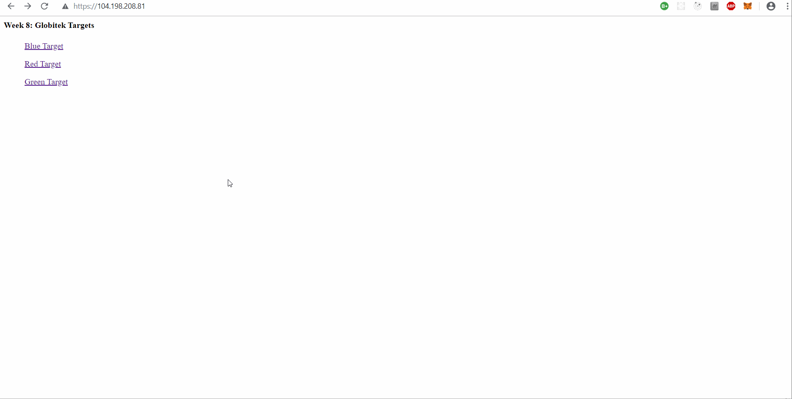
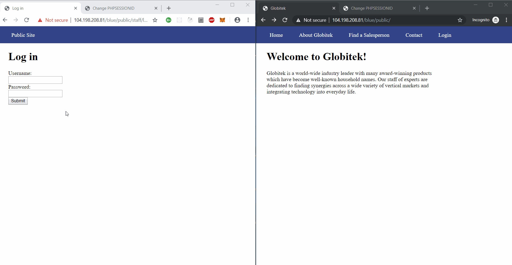
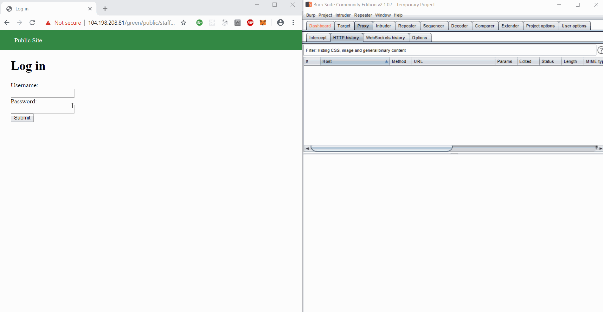
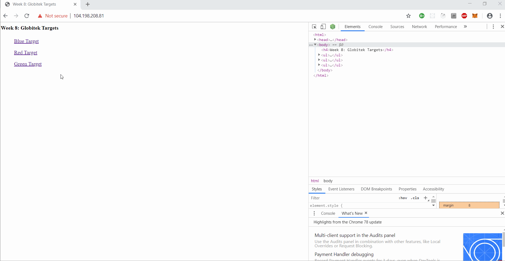
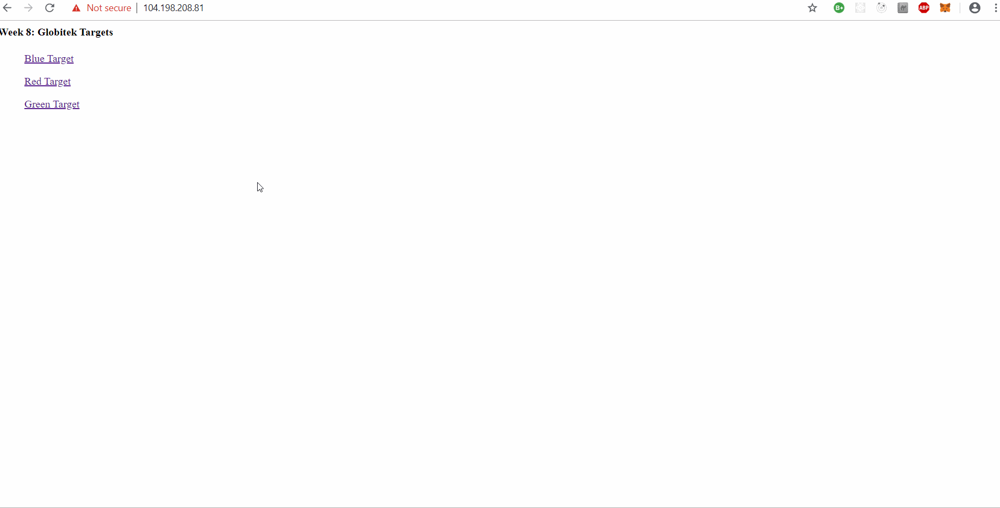

# Project 8 - Pentesting Live Targets

Time spent: **7** hours spent in total

> Objective: Identify vulnerabilities in three different versions of the Globitek website: blue, green, and red.

The six possible exploits are:
* Username Enumeration
* Insecure Direct Object Reference (IDOR)
* SQL Injection (SQLi)
* Cross-Site Scripting (XSS)
* Cross-Site Request Forgery (CSRF)
* Session Hijacking/Fixation

Each version of the site has been given two of the six vulnerabilities. (In other words, all six of the exploits should be assignable to one of the sites.)

## Blue

### Vulnerability #1: SQL Injection

Most of the data input received by these websites is being sanitized properly. However, one of the three sites has one place where the input is not being sanitized before being used in an SQL query. Determine which color has the vulnerability.

### Vulnerability #2: Session Hijacking/Fixation

Two of the three websites expire their active sessions and require users to re-login every 30 minutes. That is probably too aggressive for the real world, but it is better than the third site which allows sessions to be a year old, and never regenerates the session ID, even when the user agent string changes. This makes it vulnerable to both session hijacking and session fixation attacks.

## Green

### Vulnerability #1: Cross-Site Scripting

All three sites do a good job of protecting against a reflected XSS attack. However, one of the sites has a mistake which leaves the site vulnerable to a stored XSS attack. Determine which color has the vulnerability.

### Vulnerability #2: Username Enumeration

A careless developer mistake has created a username enumeration vulnerability. Determine which color has the vulnerability. You can use the existing username "jmonroe99" as a test. Next, figure out what mistake the developer made.

## Red

### Vulnerability #1: Cross-Site Request Forgery (CSRF)

One of the three sites does not have CSRF protections on the admin area. hen point the form action at each of the three sites to find out which color has the vulnerability. Do not neglect to be stealthy with your form—your unsuspecting, logged-in admin should neither see the form nor the results of the form submission.

### Vulnerability #2: Insecure Direct Object Reference (IDOR)

One of the three sites is missing code which would prevent some sensitive information from being made public. Determine which color has the vulnerability. Then, figure out what the other two sites did correctly to prevent the information leak.

The other two sites added a HTTP 302 response which is a common way of performing URL redirection. Now when a hacker tries to perform IDOR on the other sites, they will be redirected to ```/territories.php```
